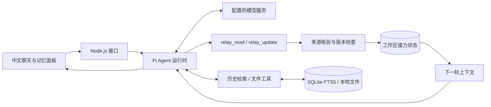

# 念头接力 · Thought Relay

**把现在的念头，接到下一步。**

一个面向长期个人任务的中文 Agent：在聊天中留下目标与下一步，在新会话中继续推进；每条接力记忆都能查看依据、手动纠正和暂停使用。

`TypeScript` · `Node.js 24` · `React 19` · `Pi Agent SDK` · `SQLite FTS5`

[五分钟体验](docs/demo.md) · [架构与设计取舍](docs/architecture.md) · [验证记录](VALIDATION.md) · [贡献边界](CHANGES-THOUGHT-RELAY.md)

## 为什么做这个项目

一个想法通常会经历多次中断：今天想清楚目标，明天发现限制，下周才开始行动。聊天记录能保存原话，却不一定能回答“我现在应该接着做什么”。如果模型把自己的建议记成用户的决定，长期记忆还会把偏差带入下一次对话。

念头接力把**目标、下一步、事实与卡点**保存为工作区状态。模型负责理解意图和调用工具；程序负责核验引文、检查版本和落盘；用户保留最终修正权。

> 你：帮我记住，我想把阳台改成小菜园，下一步是明晚测量日照。
>
> 记忆面板：显示目标、下一步和来源原话；你把下一步改为“先测量阳台可用面积”。
>
> 新会话中的你：接着上次，我现在先做什么？
>
> Agent：先测量阳台的可用面积。

这是已通过真实模型验收的演示路径，详细条件见 [验证记录](VALIDATION.md)。

## 核心工程设计

| 问题 | 实现 | 可检查的证据 |
| --- | --- | --- |
| 换个对话就失去进度 | 工作区级结构化状态与上下文注入 | 新会话接续验收 |
| 模型“记住”了用户没说的话 | 在当前分支最近六条用户消息中匹配连续引文，保留实际原文与消息 ID | 来源核验测试；面板来源链接 |
| 旧工具请求覆盖人工修正 | `expectedRevision` 乐观并发检查 + 原子文件替换 | 过时版本拒绝测试 |
| 历史片段重复或截错位置 | 全文哈希去重、来源多样性排序、命中词附近摘录 | 五组检索反例测试 |
| 工具成功、接口却报失败 | SDK 重试成功时清除旧错误，保留最终失败 | 三条重试状态回归测试 |
| 不清楚 Agent 做了什么 | 流式对话、可展开工具过程、中文接力记忆面板 | 浏览器交互与端到端验收 |

引文存在不等于模型概括正确，因此可编辑记忆是产品流程的一部分。

## 工作方式



聊天、SDK 工具循环和 FTS 索引来自上游；本项目新增接力状态层、记忆面板，并重构检索策略和重试错误处理。完整调用链与边界见 [架构文档](docs/architecture.md)。

## 本地运行

已验证环境：Linux、Node.js 24、npm 11。Web 版是本仓库的交付目标。

```bash
git clone https://github.com/findjoin/thought-relay.git
cd thought-relay
# 使用 Node.js 24 和 npm 11；Web 版无需下载 Electron 桌面程序
ELECTRON_SKIP_BINARY_DOWNLOAD=1 npm ci
npm run build
npm run start:relay
```

打开 [本地页面](http://127.0.0.1:8049/)，在左下角菜单 → 设置 → 模型服务中填写自己的接口地址、密钥和模型。接力演示需要模型支持工具调用；其他服务协议沿用上游适配。先创建一个工作区，再在原聊天框输入需求，无需另学一套操作方式。

`RELAY_PORT` 可修改端口；`RELAY_NODE` 可指定 Node.js 可执行文件。服务仅监听 `127.0.0.1`。

前端包含上游 Markdown、图表等渲染依赖。若构建出现 `JavaScript heap out of memory`，在内存充足的机器上执行 `NODE_OPTIONS=--max-old-space-size=4096 npm run build`；本仓库 CI 已设置该构建堆上限。

### 测试与验收

```bash
npm test                 # 全量回归，无需模型密钥
npm run test:relay       # 接力、历史检索和运行时相关用例
npm run build            # 后端类型检查与前端生产构建
npm run verify:live      # 另开终端，服务运行且配置模型后执行；消耗 API 额度
```

真实模型验收会创建独立示例工作区，检查“模型写入 → 人工修正 → 新会话接续”，结果留在本地 `runtime/acceptance/`。**741 条测试通过，其中本次改造新增 20 条；总量包含上游测试。** 这不是检索准确率或所有模型的兼容性指标。

## 数据与适用范围

- `runtime/config/` 保存本机配置，`runtime/data/` 保存会话与记忆，`workspace/` 保存用户文件；这些目录均被 Git 忽略。
- 记忆存储在本机。启用时，相关记忆会作为上下文发送给你选择的模型服务。
- 关闭工作区接力开关后，Agent 不再读取、注入或自动更新该工作区的接力记忆；仍可由用户在面板查看和修改。
- “忘掉这条”删除接力条目，不等于删除原始聊天、学习画像或历史索引。
- 当前是本机单用户、单进程应用；不具备多租户鉴权或分布式并发能力。
- 历史检索使用词法匹配，未引入向量数据库。搜索、OCR、消息渠道和桌面发行沿用上游代码，本次未逐项验收。

## 项目来源与维护

维护：[XiangYu Zhang / findjoin](https://github.com/findjoin)。项目基于 [Inno Agent](https://github.com/hhyqhh/inno-agent)（MIT）改造，基准提交 [`fc74cd6`](https://github.com/hhyqhh/inno-agent/commit/fc74cd6a283e8226a4307ea8c3046c715cb6e5f3)。保留上游历史、版权与 [原始 README](README.upstream.md)。新增模块与复用部分逐项记录在 [改造说明](CHANGES-THOUGHT-RELAY.md)。

许可证：[MIT](LICENSE)。原桌面发布流程仅在上游仓库运行，本仓库使用 Web 构建与测试 CI。
