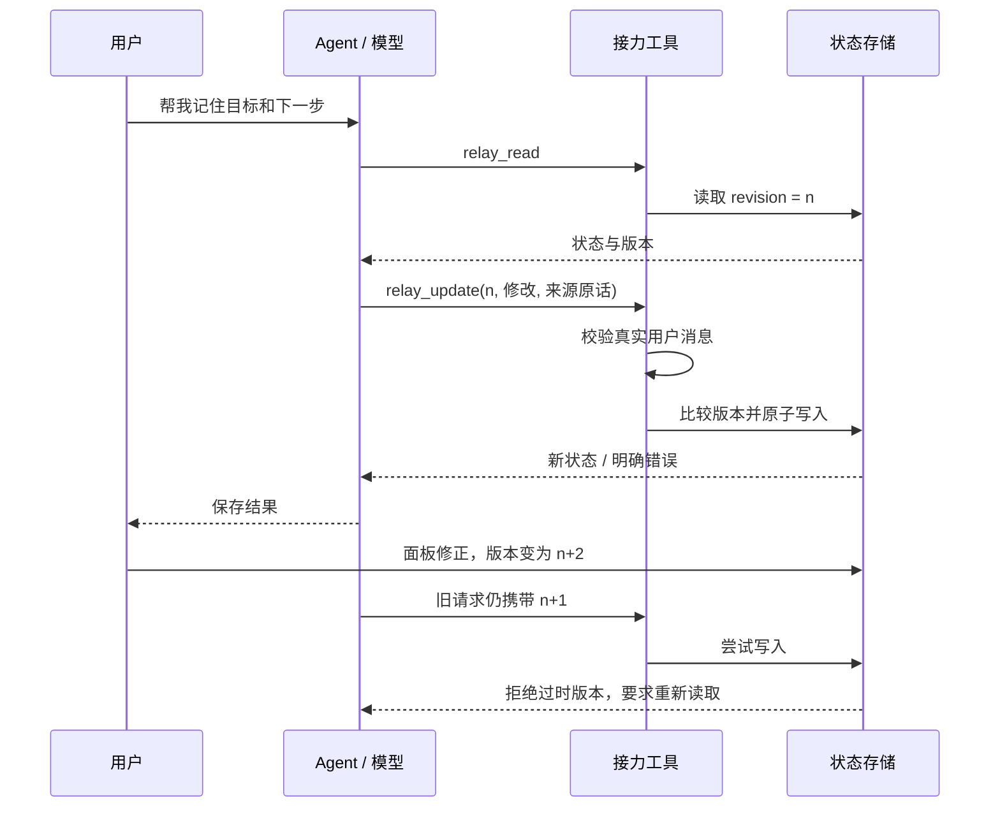

# 架构与设计取舍

## 一条消息如何变成可接续的行动

1. 用户在工作区内发送消息；上游 HTTP 与流式接口把请求交给 Pi Agent 运行时。
2. 运行时注入当前工作区的接力状态，以及原有画像、资料库和历史检索上下文。模型获得可调用工具及参数定义。
3. 模型决定调用 `relay_read`，或用 `relay_update` 提交目标、下一步、念头和来源原话。模型不直接写接力文件。
4. 工具从 SDK 当前会话分支提取最近六条用户消息，检查连续引文；排除助手内容、工具返回和跨消息拼接。
5. 存储层比较 `expectedRevision`，验证整个修改，再通过临时文件加重命名更新状态。失败时返回错误，不增加版本。
6. 工具结果返回模型，由模型继续回答。下一个会话使用同一工作区时读取已保存状态；UI 也可直接修正这一状态。

## 状态与信任边界

每个工作区由规范化绝对路径的 SHA-256 映射到独立存储文件。状态包括 `revision`、`enabled`、`goal`、`nextStep`、`notes` 和 `source`。来源记录操作方、时间、会话、用户引文，以及可获取的消息 ID。最多保存 80 条念头，上下文只注入最多 6 条未完成念头。

来源校验容忍空白差异和模型附加的句末标点，保存匹配到的实际原文；内部标点和文字改变仍被拒绝。它能证明引文存在，**不能证明概括在语义上完全忠实**，因此同时提供人工纠正。

面板走 `GET/PATCH /api/relay?workspaceId=...`；接口检查工作区、请求大小、内容类型及浏览器 Origin。它服务于 loopback 单用户应用，不构成多租户权限系统。

## 为什么把接力状态和历史检索分开

接力状态回答“当前认可的下一步是什么”；历史检索回答“过去有哪些相关材料”。前者随用户修正而更新，后者仍可能保存旧观点。提示规则要求优先采用用户当前修正，不能把助手过去的建议当作用户承诺。

| 层 | 用途 | 来源 |
| --- | --- | --- |
| 接力状态 | 当前目标、下一步、卡点，用户可编辑 | 本项目新增 |
| L1 学习画像 | 稳定背景与偏好 | 上游 |
| L2 Wiki | 文件资料的结构化组织与查询 | 上游 |
| L3 历史检索 | SQLite FTS5/BM25 候选搜索 | 上游索引 + 本项目检索策略重构 |

L3 改造保留存储与调用接口：规范化全文哈希去重，按查询词覆盖度过滤，再用 `score / (1 + 0.35 × 已选同会话数量)` 平衡来源；围绕命中词选取约 320 字符的摘录，附来源块 ID。系数是工程启发式，尚未在大样本中调参或证明最优。

## 可靠性问题：已经成功却报告失败

真实接口联调中，SDK 遇到临时错误后自动重试，工具写入和最终回答成功，运行时却仍持有早先错误。修复将错误状态转换统一到 `nextPromptError`：仅在成功重试事件清除旧错误；最终重试失败或后续新错误继续保留。同步、流式和指定会话入口使用同一规则。

这是模型生成与应用状态不同步造成的工程问题，不能靠提示词解决。回归覆盖成功重试、失败重试和成功之后的新错误。

## 代码导航

- [`relay/store.ts`](../apps/inno-agent/src/relay/store.ts)：状态、版本、来源匹配、上下文序列化。
- [`relay/tools.ts`](../apps/inno-agent/src/relay/tools.ts)：工具定义、当前分支来源、行为约束。
- [`routes/relay.ts`](../apps/inno-agent/src/server/routes/relay.ts)：HTTP 入口。
- [`RelayMemory.tsx`](../apps/inno-agent/web/src/react/RelayMemory.tsx)：人工查看与纠正。
- [`recall.ts`](../apps/inno-agent/src/memory/l3/recall.ts)：历史检索策略。
- [`pi-runner.ts`](../apps/inno-agent/src/agent/pi-runner.ts)：SDK 执行与错误生命周期。

## 当前取舍

文件存储便于本机检查与备份，同步版本检查只保证同一 Node.js 进程中的串行修改，不提供跨进程锁。工作区移动后路径标识会改变。接力暂停不会清除其他记忆层或原始聊天。下一阶段若转为服务部署，需要重新设计身份、存储事务、任务隔离和删除语义；这些尚未实现。
