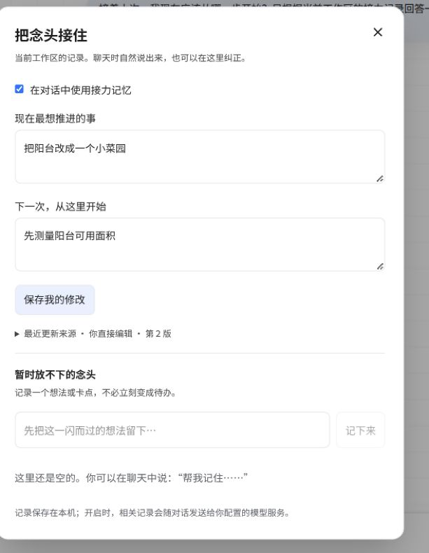

# 五分钟体验与现场演示

## 准备

按 README 安装并启动 Web 服务。配置支持工具调用的模型，在侧栏创建“阳台小菜园”工作区。演示使用以下虚构任务，不需要填写真实个人信息。

## 1. 留下一个念头

在原来的聊天输入框发送：

> 帮我记住：我想把阳台改成一个小菜园，下一步是明晚测量阳台日照。

展开工具过程，观察 `relay_read` / `relay_update`。点击“接力记忆”，应能看到目标、下一步和来源原话。只有面板中的状态实际更新，才算记忆写入成功。

## 2. 用户修正优先

在接力面板把下一步改为“先测量阳台可用面积”，保存。这个修改会推进状态版本；已经拿到旧版本的工具请求不能覆盖它。

## 3. 中断后继续

在**同一工作区**新建会话，发送：

> 接着上次，我现在应该从哪一步开始？

回答应根据修正后的“测量面积”继续。最终措辞由模型生成，不要求逐字一致。

## 4. 检查边界

换一个工作区查看接力面板，应没有刚才工作区的目标。回到示例工作区关闭接力开关，Agent 不应再通过接力工具读取或更新它；面板仍允许用户查看。关闭接力不等于清除原聊天和其他记忆层。

## 自动重放

另开终端执行 `npm run verify:live`。脚本创建独立验收工作区，完成保存、HTTP 人工修改和新会话接续，并对实际状态做断言。模型限流、调用失败或未保存都会导致验收失败。每次执行都会消耗模型额度。

## 面试展示顺序

先用三分钟完成上面的生活任务，再展示 `relay/store.ts` 的版本检查、来源信息和相关回归用例。把模型理解、工具协议与确定性状态管理分别解释清楚。遇到失败时，从工具返回、HTTP 状态、当前版本和模型服务能力逐层定位。

## 常见问题定位

| 现象 | 首先检查 | 处理 |
| --- | --- | --- |
| 只回复“记住了”，面板没变化 | 工具过程是否出现成功写入 | 确认模型支持工具调用，查看工具错误 |
| 原话校验失败 | 引文是否来自当前分支最近六条用户消息 | 使用用户实际原文，避免拼接或改写 |
| 提示记录已变化 | 工具或面板使用了过时版本 | 重新读取并审阅新状态后再修改 |
| 接力工具显示停用 | 工作区开关与长期画像总开关 | 用户按需要开启 |
| 新对话接不上 | 是否仍在原工作区、接力是否开启 | 检查工作区归属与面板记录 |
| 模型限流 / 不存在 | 服务商返回的错误与可用模型 | 修正配置；工具状态成功与模型回答成功分别核对 |

## 能证明什么

这条演示验证需求拆解、工具调用、状态持久化、人工纠正与跨会话接续。它没有覆盖长周期真实使用成效，也不代表所有模型服务都已兼容。
